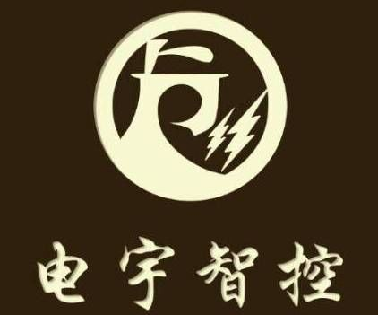
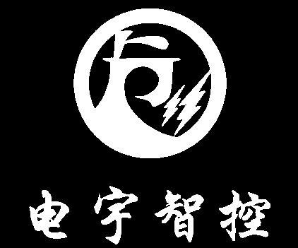
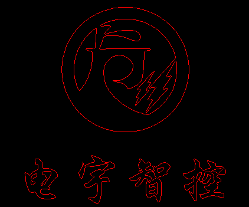
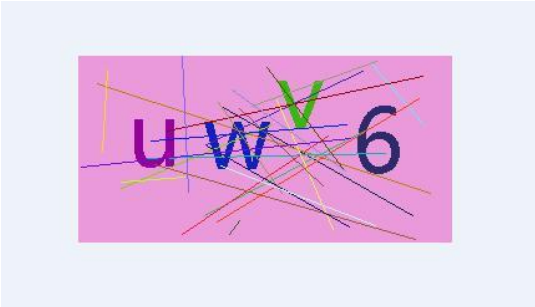
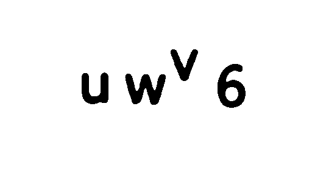
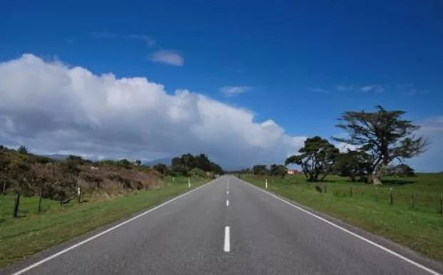
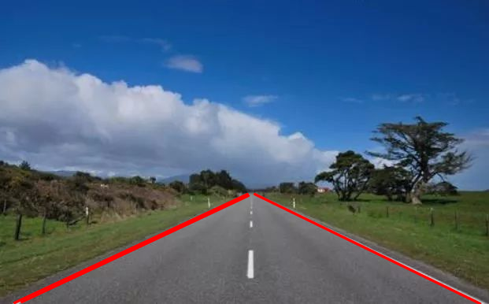
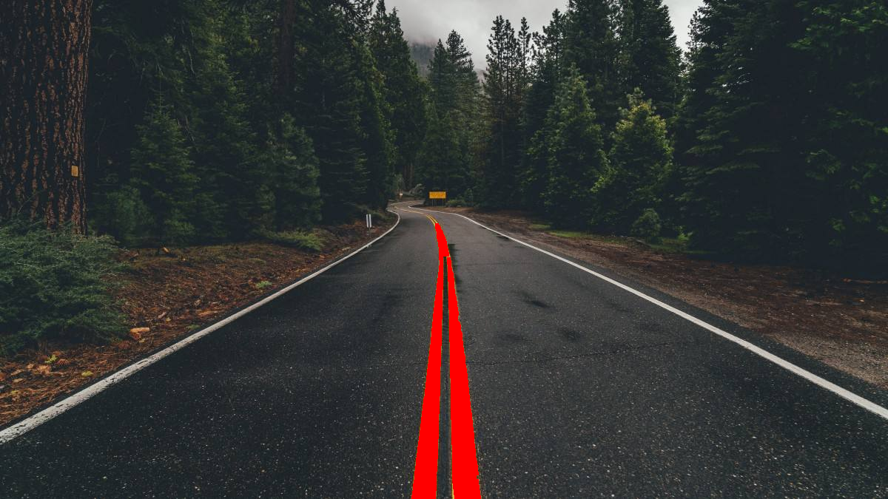

# OpenCV

## opencv-python

### 常用函数

#### 在图像上绘制矩形`cv2.rectangle`

```Python
cv2.rectangle(img, pt1, pt2, color, thickness, lineType, shift)
```

参数：

- `img`：要在其上绘制矩形的图像。
- `pt1`：矩形的起始坐标（左上角）。坐标表示为两个值的元组，即(X坐标值，Y坐标值)。
- `pt2`：矩形的结束坐标（右下角）。坐标表示为两个值的元组，即(X坐标值，Y坐标值)。
- `color`：矩形边界线的颜色。通过一个元组指定BGR。例如：(255，0，0)为蓝色。
- `thickness`：矩形边框线的粗细像素。厚度-1像素将以指定的颜色填充矩形形状。

#### 在图像上绘制文本字符串`cv2.putText`

```Python
def putText(
    img: MatLike,
    text: str,
    org: Point,
    fontFace: int,
    fontScale: float,
    color: Scalar,
    thickness: int = ...,
    lineType: int = ...,
    bottomLeftOrigin: bool = ...
) -> MatLike: ...
```

参数：

- `img`：要在其上绘制文本的图像。
- `text`：要绘制的文本字符串。
- `org`：它是图像中文本字符串左下角的坐标。坐标表示为两个值的元组，即(X坐标值，Y坐标值)。
- `fontFace`：字体类型。一些字体类型是FONT_HERSHEY_SIMPLEX，FONT_HERSHEY_PLAIN等。
- `fontScale`：字体比例因子乘以font-specific基本大小。
- `color`：要绘制的文本字符串的颜色。通过一个元组指定BGR。例如：(255，0，0)为蓝色。
- `thickness`：线的粗细像素。
- `lineType`：可选参数，它给出了要使用的行的类型。
- `bottomLeftOrigin`：可选参数。如果为true，则图像数据原点位于左下角。否则，它位于左上角。

### 学习测试实例

*PythonApplication1.py*

```Python
Python 3.10
numpy 1.23.0
opencv-python 4.5.5
```

```Python
import cv2
import numpy
import copy
```

#### 读取图像

```Python
img = cv2.imread("beauty.png")
```

#### 创建窗口

```Python
W1 = cv2.namedWindow("W1") 
```

#### 显示图像

```Python
def cv_show(windowname, img):
    cv2.imshow(windowname, img)
    key =  cv2.waitKey()
    if key & 0xFF == ord('q'):
        cv2.destroyAllWindows()

cv_show("picture_show", img)
```

#### 保存图像

```Python
r = cv2.imwrite("beauty-out.png", img)
if r==True:
    print("图像保存成功！")
    print(type(img))

cv2.waitKey(0)  # 无限等待按键
```

#### 创建黑白图

```Python
img2 = numpy.zeros((16,16), dtype=numpy.uint8) # 该函数默认全为0

cv2.imshow("img-2", img2)
cv2.waitKey(0)
cv2.destroyAllWindows()
```

#### 灰度图

```Python
img3 = cv2.imread("E:/beauty.png", 0) # 单通道灰度 读取图像

cv2.imshow("img-3", img3)
cv2.waitKey(0)
cv2.destroyAllWindows()
```

#### 通过索引改变图像

```Python
for i in range(100,601):
    for j in range(200,300):
        img[i,j] = 255

cv2.imshow("img-4", img)
cv2.waitKey(0)
cv2.destroyAllWindows()
```

#### 生成一副彩色随机图像

```Python
img5 = numpy.random.randint(0,256,size=[500,500,3],dtype=numpy.uint8)

cv2.imshow("img-5", img5)
cv2.waitKey(0)
cv2.destroyAllWindows()
```

#### 图像通道拆分

```Python
b = img[:,:,0]
g = img[:,:,1]
r = img[:,:,2]

cv2.imshow("img-b", b)
cv2.imshow("img-g", g)
cv2.imshow("img-r", r)
cv2.waitKey(0)
cv2.destroyAllWindows()
```

#### 图像通道合并

```Python
rgb = cv2.merge([r, g ,b])

cv2.imshow("b->r, g->g, r->b", rgb)
cv2.waitKey(0)
cv2.destroyAllWindows()
```

#### 变量测试

```Python
imgg = img      # 这两个变量指向同一内存
imgg[:,:,0]=0
cv2.imshow("imgg",imgg)
print(id(img),id(imgg))
```

#### 使用copy模块进行 浅拷贝&深拷贝

```Python
imgg = copy.copy(img)
print(id(imgg),id(img))
print(type(imgg),type(img))
```

#### 图像加法

```Python
# +
img6 = numpy.random.randint(0,256,size=[500,500],dtype=numpy.uint8)
img7 = numpy.random.randint(0,256,size=[500,500],dtype=numpy.uint8)
img8 = img6 + img7

cv2.imshow("img6",img6)
cv2.imshow("img7",img7)
cv2.imshow("img8",img8)
cv2.waitKey(0)
cv2.destroyAllWindows()

# add()
imgg = img
img1 = cv2.add(img, imgg)
img2 = img + imgg

cv2.imshow("add()",img1)
cv2.imshow("+",img2)
cv2.waitKey(0)
cv2.destroyAllWindows()
```

#### 图像加权和

```Python
p1 = cv2.imread("E:/p1.png")
p2 = cv2.imread("E:/p2.png")
mixp = cv2.addWeighted(p1,0.6,p2,0.4,50)

cv2.imshow("mixp",mixp)
cv2.waitKey(0)
cv2.destroyAllWindows()
```

#### 图像位运算

```Python
a = numpy.zeros(img.shape,dtype=numpy.uint8)
a[100:800,300:1000] = 255
b = cv2.bitwise_and(img,a)

cv2.imshow("a & img",b)
cv2.waitKey(0)
cv2.destroyAllWindows()
```

#### 位平面提取

```Python
imgg = cv2.imread("E:/beauty.png",0)
r,c = imgg.shape
x = numpy.zeros((r,c),dtype=numpy.uint8)
x[:,:] = 2**7
imgg = cv2.bitwise_and(imgg,x)
mask = imgg[:,:]>0
imgg[mask] = 255

cv2.imshow("imgg",imgg)
cv2.waitKey(0)
cv2.destroyAllWindows()
```

#### 提取肤色区域

```Python
hsv = cv2.cvtColor(img, cv2.COLOR_BGR2HSV)
h,s,v = cv2.split(hsv)
minHue = 5
maxHue = 170
hueMask = cv2.inRange(h, minHue, maxHue)
minSat = 25
maxSat = 166
satMask = cv2.inRange(s, minSat, maxSat)
mask = hueMask & satMask
roi = cv2.bitwise_and(img, img, mask = mask)

cv2.imshow("ROI", roi) 
cv2.waitKey(0)
cv2.destroyAllWindows()
```

#### 调整HSV

```Python
hsv = cv2.cvtColor(img, cv2.COLOR_BGR2HSV)
h,s,v = cv2.split(hsv)
v[:,:,] = 255
newhsv = cv2.merge([h,s,v])
art = cv2.cvtColor(newhsv, cv2.COLOR_HSV2BGR)

cv2.imshow("art", art)
cv2.waitKey(0)
cv2.destroyAllWindows()
```

#### BGRA alpha通道

```Python
bgra = cv2.cvtColor(img, cv2.COLOR_BGR2BGRA)
b,g,r,a = cv2.split(bgra)
a[:,:] = 10
new_bgra = cv2.merge([b,g,r,a])

cv2.imshow("new_bgra", new_bgra)
cv2.imwrite("new_bgra.png", new_bgra)

cv2.waitKey(0)
cv2.destroyAllWindows()
```

#### 图像几何变换

```Python
rst = cv2.resize(img, None, fx=0.6, fy=0.6) # 放缩
dst = cv2.flip(img, 6)                      # 翻转

h,w = img.shape[:2]                         #平移
x = 100
y = 200
M = numpy.float32([[1, 0, x], [0, 1, y]])
move = cv2.warpAffine(img, M, (w, h))

M2 = cv2.getRotationMatrix2D((w/2, h/2), 45, 0.6)   # 旋转
rotate = cv2.warpAffine(img, M2, (w, h))

cv2.imshow("rst", rst)
cv2.imshow("dst", dst)
cv2.imshow("move", move)
cv2.imshow("rotate", rotate)

cv2.waitKey(0)
cv2.destroyAllWindows()
```

#### 阈值处理

```Python
t, rst = cv2.threshold(img, 136, 255, cv2.THRESH_BINARY)
t2, rst2 = cv2.threshold(img, 127, 255, cv2.THRESH_BINARY_INV)
imgg=cv2.imread("E:/beauty.png", 0)
t3, rst3 = cv2.threshold(imgg, 0, 255, cv2.THRESH_BINARY + cv2.THRESH_OTSU)     # 似乎不支持彩色

print(t, "\n", rst)
print(t2, "\n", rst2)
print(t3, "\n", rst3)
cv2.imshow("rst", rst)
cv2.imshow("rst2", rst2)
cv2.imshow("rst3", rst3)

cv2.waitKey(0)
cv2.destroyAllWindows() 
```

#### Canny边缘检测

```Python
imgg = cv2.imread("E:/beauty.png", 0) # 单通道灰度 读取图像
r = cv2.Canny(imgg, 24, 80)

cv2.imshow("r", r)
cv2.waitKey(0)
cv2.destroyAllWindows()
```

#### 图像金字塔

```Python
down = cv2.pyrDown(img)
down_up = cv2.pyrUp(down)
diff = img - down_up

cv2.imshow("diff", diff)
cv2.waitKey(0)
cv2.destroyAllWindows()
```

### 学习考核题

#### 第一题 图像的读取、几何变换、显示与保存

> 编写调用了OpenCV(python)库的.py程序，读取任意一张图像，将其绕x轴、y轴同时翻转后显示并保存为 dst1.png

```Python
import cv2
import numpy

img=cv2.imread("beauty.png")
dst = cv2.flip(img, -1)
cv2.imshow("dst1.png", dst)
r = cv2.imwrite("dst1.png", dst)

if r==True:
    print("图像保存成功！")

cv2.waitKey(0)
cv2.destroyAllWindows()
```


#### 第二题 边缘检测

> 使用opencv提取图片 lab_logo.jpg 轮廓，要求代码生成二份result图片，分别为：<br>
1、原图二值化后的图片result_1.png；<br>
2、原图的轮廓提取图片result_2.png，轮廓由红线标出；<br>

```Python
import cv2
import numpy

img = cv2.imread("lab_logo.jpg", 0)

# 阈值处理
retval, img = cv2.threshold(img, 80, 255, cv2.THRESH_BINARY)
cv2.imwrite("result_1.png", img)

# 轮廓提取
contours, hierarchy = cv2.findContours(img, cv2.RETR_LIST, cv2.CHAIN_APPROX_NONE)
dst = numpy.zeros(img.shape, numpy.uint8)
dst = cv2.drawContours(dst, contours, -1, 255)

b = numpy.zeros(img.shape, numpy.uint8)
g = numpy.zeros(img.shape, numpy.uint8)
result_2 = cv2.merge([b, g, dst])
cv2.imwrite("result_2.png", result_2)
```





#### 第三题 验证码去噪

> 利用自己所学的OpenCV知识对验证码图像 identify_code.png 进行去噪，将其中的干扰线条、噪点去除，提取出只含纯净字符的图片。将清晰的验证码图像显示并保存为 clear_identify_code.png ，提取的字符越清晰饱满，得分越高。

```Python
import cv2
import numpy

img = cv2.imread("identify_code.png", 0)

# 阈值处理
retval, img = cv2.threshold(img, 168, 255, cv2.THRESH_BINARY_INV)
# 开运算
K1 = numpy.ones((5,5), numpy.uint8)
img = cv2.morphologyEx(img, cv2.MORPH_OPEN, K1)
# 闭运算
K2 = numpy.ones((2,2), numpy.uint8)
img = cv2.morphologyEx(img, cv2.MORPH_CLOSE, K2)
# 腐蚀
img = cv2.erode(img, K2)

# 滤波
img1 = cv2.GaussianBlur(img,(11,11), 0, 0)
img2 = cv2.GaussianBlur(img1,(11,11), 0, 0)

# 阈值处理
retval, dst = cv2.threshold(img2, 64, 255, cv2.THRESH_BINARY_INV)

cv2.imshow("identify_code.png", dst)
cv2.imwrite("clear_identify_code.png", dst)

cv2.waitKey(0)
cv2.destroyAllWindows()
```




#### 第四题 绘制公路轮廓与黄线

> 活用OpenCV的直线检测方法，通过图像转换、模糊降噪、边缘检测、调整函数阈值、颜色提取等手段，尽量实现：<br>
1、大致标注出图 road1.jpg 所示公路的两侧轮廓<br>
2、大致标志出图 road2.jpg 所示公路的中间黄线<br>

```Python
import cv2
import numpy

img1 = cv2.imread("road1.jpg")
img2 = cv2.imread("road2.jpg")

# ------------img1------------
imgg1 = cv2.cvtColor(img1, cv2.COLOR_BGR2GRAY)

# 阈值处理
retval, imgg1 = cv2.threshold(imgg1, 140, 255, cv2.THRESH_BINARY)
# Canny
edges = cv2.Canny(imgg1, 216, 168)
# 霍夫变换
lines = cv2.HoughLinesP(edges, 1, numpy.pi/180, 68, minLineLength=216, maxLineGap=32)
for line in lines:
    x1, y1, x2, y2 = line[0]
    img1 = cv2.line(img1, (x1,y1), (x2,y2), (0,0,255), 2, cv2.LINE_AA) # 绘制

cv2.imshow("img1", img1)
cv2.imwrite("result1.png", img1)


# ------------img2------------
imgg2 = cv2.cvtColor(img2, cv2.COLOR_BGR2GRAY)
mask = numpy.zeros(imgg2.shape, numpy.uint8)
# 阈值处理
retval, imgg2 = cv2.threshold(imgg2, 128, 255, cv2.THRESH_BINARY)

# 闭 开
K = numpy.ones((5,5), numpy.uint8)
imgg2 = cv2.morphologyEx(imgg2, cv2.MORPH_CLOSE, K) # 膨胀 腐蚀
imgg2 = cv2.morphologyEx(imgg2, cv2.MORPH_OPEN, K)  # 腐蚀 膨胀

# 霍夫变换
lines2 = cv2.HoughLinesP(imgg2, 1, numpy.pi/180, 256, minLineLength=316, maxLineGap=4)
for line in lines2:
    x1, y1, x2, y2 = line[0]
    mask = cv2.line(mask, (x1,y1), (x2,y2), 255, 10, cv2.LINE_AA) # 绘制

# 膨胀
K = numpy.ones((45,45), numpy.uint8)
mask = cv2.dilate(mask, K)

mask_dst = cv2.bitwise_and(mask, imgg2)

b, g, r = cv2.split(img2)

retval, mask_dst_f = cv2.threshold(mask_dst, 127, 255, cv2.THRESH_BINARY_INV)
b = cv2.bitwise_and(b, mask_dst_f)
g = cv2.bitwise_and(g, mask_dst_f)
r = cv2.bitwise_or(r, mask_dst)

bgr = cv2.merge([b,g,r])

cv2.imshow("bgr", bgr)
cv2.imwrite("result2.png", bgr)


cv2.waitKey(0)
cv2.destroyAllWindows()
```





