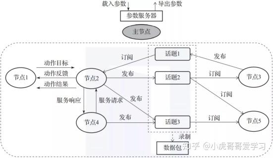
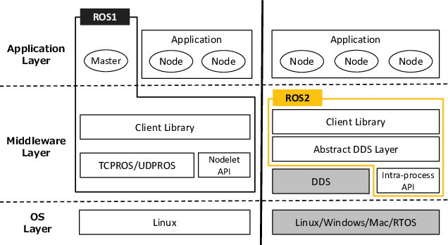
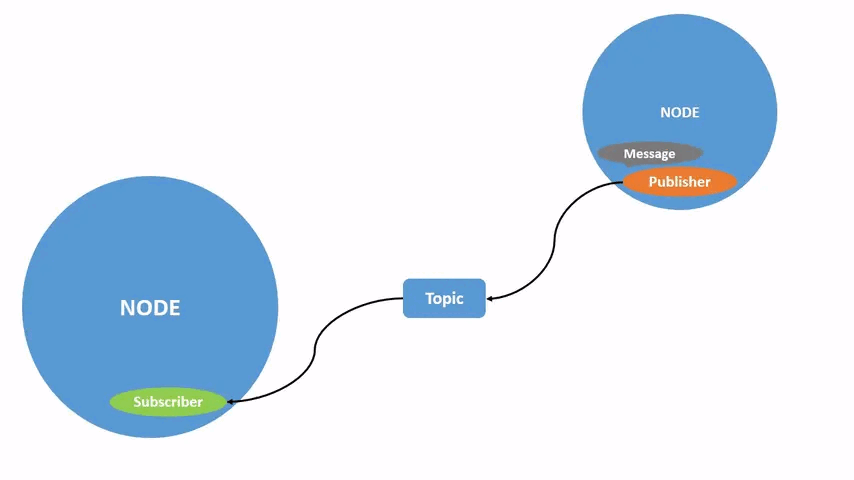
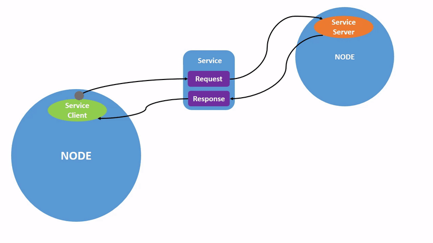
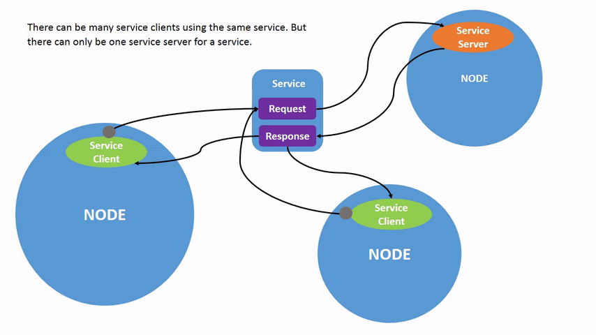
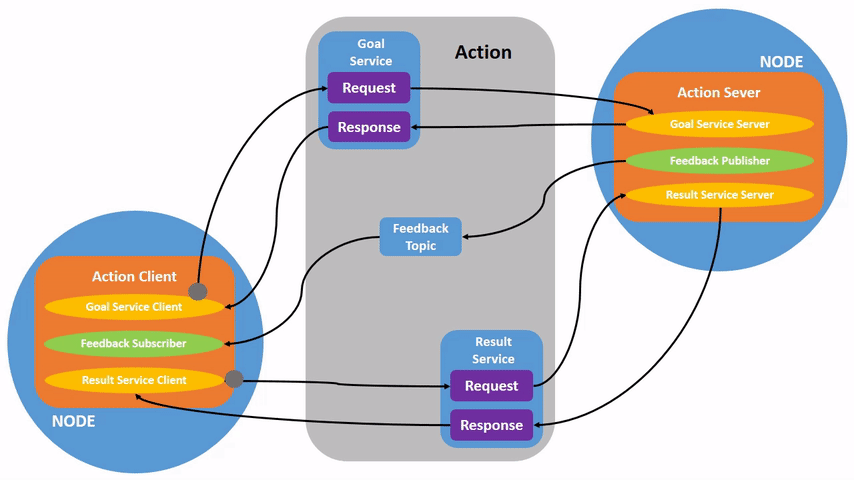

# ROS

*怕什么真理无穷，进一步有进一步的欢喜*

---

## 认识What

### [ROS机器人操作系统终于有人给讲明白了 - 知乎](https://zhuanlan.zhihu.com/p/500130466)



> 可能很多初学者听到机器人操作系统，就被“操作系统”几个字吓住了。其实简单点说，ROS就是一个分布式的通信框架，帮助程序进程之间更方便地通信。
> 一个机器人通常包含多个部件，每个部件都有配套的控制程序，以实现机器人的运动与视听功能等。那么要协调一个机器人中的这些部件，或者协调由多个机器人组成的机器人集群，怎么办呢？这时就需要让分散的部件能够互相通信，在多机器人集群中，这些分散的部件还分散在不同的机器人上。解决这种分布式通信问题正是ROS的设计初衷。
>
> ROS的核心思想就是将机器人的软件功能做成一个个节点，节点之间通过互相发送消息进行沟通。这些节点可以部署在同一台主机上，也可以部署在不同主机上，甚至还可以部署在互联网上。ROS网络通信机制中的主节点（master）负责对网络中各个节点之间的通信过程进行管理调度，同时提供一个用于配置网络中全局参数的服务。

## ROS1与ROS2

### 架构



---

## ROS1

### B站视频教程ROS1-Noetic文档摘录[【Autolabor初级教程】ROS机器人入门](https://www.bilibili.com/video/BV1Ci4y1L7ZZ/)

**go to `ROS1Noetic文档.md`**

---

## ROS2

### 学习资源

#### [【古月居】古月·ROS2入门21讲 | 带你认识一个全新的机器人操作系统](https://www.bilibili.com/video/BV16B4y1Q7jQ/)

优点：概念清晰透彻；

缺点：只有Python；只有代码展示解读；

#### [【鱼香ROS】动手学ROS2|ROS2基础入门到实践教程|小鱼带你手把手学习ROS2](https://www.bilibili.com/video/BV1gr4y1Q7j5/)

优点：代码手把手带着敲，编写细节到位；C++、Python双语言；

缺点：ROS2概念讲解模糊，难理解；

### 文件系统

#### 工作空间的目录结构

*[1.5 ROS2体系框架【万字干货来啦，快来码住】 - 知乎](https://zhuanlan.zhihu.com/p/655747465)*

```auto
WorkSpace --- 自定义的工作空间。
    |--- build：存储中间文件的目录，该目录下会为每一个功能包创建一个单独子目录。
    |--- install：安装目录，该目录下会为每一个功能包创建一个单独子目录。
    |--- log：日志目录，用于存储日志文件。
    |--- src：用于存储功能包源码的目录。
        |-- C++功能包
            |-- package.xml：包信息，比如:包名、版本、作者、依赖项。
            |-- CMakeLists.txt：配置编译规则，比如源文件、依赖项、目标文件。
            |-- src：C++源文件目录。
            |-- include：头文件目录。
            |-- msg：消息接口文件目录。
            |-- srv：服务接口文件目录。
            |-- action：动作接口文件目录。
        |-- Python功能包
            |-- package.xml：包信息，比如:包名、版本、作者、依赖项。
            |-- setup.py：与C++功能包的CMakeLists.txt类似。
            |-- setup.cfg：功能包基本配置文件。
            |-- resource：资源目录。
            |-- test：存储测试相关文件。
            |-- 功能包同名目录：Python源文件目录。
```

另外，无论是Python功能包还是C++功能包，都可以自定义一些配置文件相关的目录。上述这些目录也可以定义为其他名称，或者根据需要创建其他一些目录。

```auto
|-- C++或Python功能包
    |-- launch：存储launch文件。
    |-- rviz：存储rviz2配置相关文件。
    |-- urdf：存储机器人建模文件。
    |-- params：存储参数文件。
    |-- world：存储仿真环境相关文件。
    |-- map：存储导航所需地图文件。
    |-- ......
```

### rcl: ROS Client Library

rcl，ROS客户端库，是ROS2的底层通信库，负责处理节点之间的通信、消息传递和服务调用等功能。

- C++：`rclcpp`
    `#include "rclcpp/rclcpp.hpp"`
- Python：`rclpy`
    `import rclpy`

### 开发流程

1. 创建工作空间
2. 编译工作空间：`colcon build`
3. 设置环境变量

    ```Bash
    $ source install/setup.bash     # 仅在当前终端生效
    $ echo "source .../WorkSpace/install/setup.bash" >> ~/.bashrc # 所有终端均生效
    ```

4. 创建功能包：`ros2 pkg create --build-type <build-type> <package_name>`

    ```Bash
    $ cd .../WorkSpace/src
    $ ros2 pkg create --build-type ament_cmake learning_pkg_cpp     # C++
    $ ros2 pkg create --build-type ament_python learning_pkg_python # Python
    ```

5. 编写代码
6. 编译功能包

    ```Bash
    $ cd .../WorkSpace
    $ colcon build   # 编译工作空间所有功能包
    $ source install/setup.bash
    ```

### 通信机制

#### 1.话题Topic




话题是单向的，而且不需要等待服务端上线，直接发就行，数据的实时性比较高。

频率高，实时性强的传感器数据的传递一般使用话题实现。

#### 2.服务Service





服务是双向的，客户端发送请求后，服务端有响应，可以得知服务端的处理结果。

频率较低，强调服务特性和反馈的场景一般使用服务实现。

#### 3.参数Parameter

参数是节点的设置，用于配置节点，原理基于服务。

#### 4.动作Action



### ROS2 CLI

#### 编译

只编译一个包

```Bash
colcon build --packages-select YOUR_PKG_NAME 
```

不编译测试单元

```Bash
colcon build --packages-select YOUR_PKG_NAME  --cmake-args -DBUILD_TESTING=0
```

运行编译的包的测试

```Bash
colcon test
```

允许通过更改src下的部分文件来改变install（重要）
每次调整 python 脚本时都不必重新build了

```Bash
# 启用--symlink-install后将不会把文拷贝到install目录，而是通过创建符号链接的方式。
colcon build --symlink-install
```

#### ROS2接口常用命令

查看所有接口包

```Bash
ros2 interface packages
```

查看接口列表

```Bash
ros2 interface list
```

查看某一个包下的所有接口

```Bash
ros2 interface package std_msgs
```

查看某一个接口详细的内容

```Bash
ros2 interface show std_msgs/msg/String
```

查看某一接口所有属性

```Bash
ros2 interface proto sensor_msgs/msg/Image
```

#### ROS2服务常用命令

查看服务列表

```Bash
ros2 service list
```

手动调用服务

```Bash
ros2 service call /add_two_ints example_interfaces/srv/AddTwoInts "{a: 5,b: 10}"
```

查看服务接口类型

```Bash
ros2 service type /add_two_ints
```

查找使用某一接口的服务、

```Bash
ros2 service find example_interfaces/srv/AddTwoInts
```

#### 参数

查看参数列表

```Bash
ros2 param list
```

参数查询与修改

```Bash
ros2 param describe turtlesim background_b  # 查看某个参数的描述信息
ros2 param get turtlesim background_b       # 查询某个参数的值
ros2 param set turtlesim background_b 10    # 修改某个参数的值
```

参数文件保存与加载

```Bash
ros2 param dump turtlesim >> turtlesim.yaml     # 将某个节点的参数保存到参数文件中
ros2 param load turtlesim turtlesim.yaml        # 一次性加载某一个文件中的所有参数
```

#### RQT工具

> RQT是一个GUI框架，通过插件的方式实现了各种各样的界面工具。

```Bash
rqt
```

计算图

```Bash
rqt_graph 
```

### ROS2-Foxy 串口通讯

环境：Ubuntu20.04 + ROS2-Foxy
时间：2023年11月

截至目前，在全网搜了搜关于ROS2-Foxy串口通信的内容，没有找到官方正式的办法，好像也并没有官方的串口包。通过综合参考几个文档，安装一个大佬修改适配的第三方包，成功实现了串口通讯。

#### 一、环境准备

##### （一）安装ros2-for-serial-driver

```Bash
sudo apt install ros-foxy-serial-driver
```

##### （二）安装第三方包串口包

GitHub: [ZhaoXiangBox/serial: ROS2 foxy serial](https://github.com/ZhaoXiangBox/serial)

###### 1. 下载源码

```Bash
git clone https://github.com/ZhaoXiangBox/serial.git
```

###### 2. 编译源码

```Bash
cd serial
mkdir build
cd build
cmake ..
make
```

###### 3. 安装

```Bash
sudo make install
```

##### （三）加载共享库缓存

```Bash
sudo ldconfig
```

如果没有安装过第三方开源库，需要将第三方库常用安装路径写入共享库配置文件中：

```Bash
sudo sh -c "echo '/usr/local/lib' >> /etc/ld.so.conf"
sudo ldconfig
```

##### （四）安装串口调试工具

```Bash
sudo apt-get install cutecom
```

#### 二、示例代码

串口操作包的 API 请参考：[serial: Serial Library](http://wjwwood.io/serial/doc/1.1.0/index.html)

```C++
#include "rclcpp/rclcpp.hpp"
#include "serial/serial.h"

serial::Serial ser;//数据串口

#define sBUFFERSIZE 1000// send buffer size 串口发送缓存长度
#define rBUFFERSIZE 1000// receive buffer size 串口接收缓存长度
unsigned char s_buffer[sBUFFERSIZE]; //发送缓存
unsigned char r_buffer[rBUFFERSIZE]; //接收缓存

class ExampleNode : public rclcpp::Node
{
public:
    // 构造函数,有一个参数为节点名称
    ExampleNode(std::string name) : Node(name)
    {
        RCLCPP_INFO(this->get_logger(), "大家好，我是%s.", name.c_str());

        // 创建发布者
        ser_pub = this->create_publisher<XXX>("ser_data", 10);
        // 创建定时器，500ms为周期，定时发布
        timer = this->create_wall_timer(std::chrono::milliseconds(500), std::bind(&ExampleNode::timer_callback, this));

    }

private:
    void timer_callback()
    {
        if (ser.available()) {

            size_t bytes_read_r_buffer = ser.read(r_buffer, ser.available());//bytes_read_r_buffer 自己定义的r_buffer读到多少bytes

            printf("bytes_read_r_buffer: %zd\n", bytes_read_r_buffer);

            // 数据转换打包
            
            ...

            // 发布消息
            ser_pub->publish(XXX);
            // 日志打印
            RCLCPP_INFO(this->get_logger(), "接收到串口数据，发送成功！");
        }
        else
        {
            //test
            RCLCPP_INFO(this->get_logger(), "500ms内未接收到串口数据");
        }
    }
    // 声名定时器指针
    rclcpp::TimerBase::SharedPtr timer;
    // 声明话题发布者指针
    rclcpp::Publisher<XXX>::SharedPtr ser_pub;
};

int main(int argc, char **argv)
{
    /* 初始化rclcpp */
    rclcpp::init(argc, argv);

    //串口初始化
    try
    {
        ser.setPort("/dev/ttyUSB0");
        ser.setBaudrate(115200);
        //串口设置
        serial::Timeout to = serial::Timeout::simpleTimeout(1000);
        ser.setTimeout(to);

        ser.setStopbits(serial::stopbits_t::stopbits_one);
        ser.setBytesize(serial::bytesize_t::eightbits);
        ser.setParity(serial::parity_t::parity_none);       //设置校验位

        //打开
        ser.open();
    }
    catch(serial::IOException &e)
    {
        std::cout<<"unable to open ser"<<std::endl;
        return -1;
    }
    catch(std::invalid_argument &e)
    {
        std::cout<<"std::invalid_argument"<<std::endl;
        return -1;
    }
    catch(serial::SerialException &e)
    {
        std::cout<<"serial::SerialException"<<std::endl;
        return -1;
    }
    //检查串口
    if(ser.isOpen())
    {
        std::cout<<"ser open"<<std::endl;
    }
    else
    {
        return -1;
    }
    

    /* 产生一个的节点 */
    auto node = std::make_shared<ExampleNode>("example_node");
    // 打印一句自我介绍
    RCLCPP_INFO(node->get_logger(), "example_node节点已经启动.");
    /* 运行节点，并检测退出信号 Ctrl+C */
    rclcpp::spin(node);
    /* 停止运行 */
    rclcpp::shutdown();

    //关闭串口
    ser.close();

    return 0;
}
```

#### 三、参考

- [ubuntu下ROS2-foxy中安装serial串口包-CSDN博客](https://blog.csdn.net/weixin_64184244/article/details/127623370)
- [Ubuntu22.04下ROS2 Humble串口通信-CSDN博客](https://blog.csdn.net/qq_50972633/article/details/132837550)
- [ROS进阶——串口通讯-CSDN博客](https://blog.csdn.net/Kalenee/article/details/82422196)

#### 四、【避雷】尝试失败的方法

鱼香ROS自己写的一个包`FishProtocol`：安装后，运行样例代码没有跑通。

- [serial串口通信 | 鱼香ROS](https://fishros.org.cn/forum/topic/547/serial%E4%B8%B2%E5%8F%A3%E9%80%9A%E4%BF%A1)
- [fishros/fish_protocol: FishProtocol是一个方便的C++多协议(串口/UDP/TCP)通信库](https://github.com/fishros/fish_protocol)

### ChatPGT v3.5 Q&A

#### ROS2一个功能包下可以有多个节点吗？

是的，ROS 2允许在同一个功能包（package）下包含多个节点（nodes）。在ROS 2中，一个功能包可以包含多个节点，这些节点可以相互通信和协作，以完成各自的任务。每个节点可以独立运行，具有自己的名称、功能和通信方式。这种设计使得ROS 2更加灵活，能够支持分布式系统和多机器人系统的开发。在一个功能包中，可以定义多个节点，并将它们分别进行编译、运行和调试。

#### ROS2一般怎样控制硬件？

在ROS 2中，控制硬件通常通过创建和使用对应的ROS 2节点来实现。以下是一般的步骤：

1. 硬件驱动程序：首先，你需要为你的硬件编写相应的驱动程序。这通常是与硬件通信的代码，通过读取传感器数据或发送控制命令与硬件进行交互。

2. 创建节点：在ROS 2中，你可以创建一个控制硬件的节点。一个节点是一个独立的执行单元，可以通过ROS 2通信机制与其他节点进行通信。你可以使用ROS 2提供的编程语言（如C++或Python）编写节点。

3. 定义消息：在ROS 2中，你需要定义与硬件通信所需的消息格式。消息定义了传递给节点的数据的结构和类型。你可以使用ROS 2提供的消息定义语言（如.msg或.srv文件）定义消息格式。

4. 发布与接收消息：在节点中，你可以使用“发布者”（Publisher）将传感器数据或控制命令发布到ROS 2系统中，其他节点可以通过“订阅者”（Subscriber）接收这些数据。这种发布/订阅模式是ROS 2中最常用的通信机制。

5. 编译和运行：在你完成节点的编写后，你需要将代码编译成可执行文件，并运行节点。你可以使用ROS 2提供的构建系统（如colcon）来编译功能包，并使用ROS 2工具（如ros2 run命令）来启动节点。

6. 控制硬件：一旦节点开始运行，你可以通过发布适当的消息（如控制命令）来控制你的硬件。你的硬件驱动程序将读取这些命令，并相应地操作硬件。

需要注意的是，实际控制硬件的步骤可能因具体硬件设备的类型和接口而有所不同。有些硬件可能需要使用特定的硬件接口库或协议来与之通信。因此，你可能需要根据硬件的要求进行额外的配置和开发。

#### ROS控制硬件一般计算平台与底层硬件之间采用怎样的电气连接？

ROS本身并不特定于任何特定的电气连接方式，它是一个开放的、通用的机器人软件平台，可以与各种类型的硬件进行通信。因此，具体的电气连接方式取决于所使用的硬件以及与之交互的接口类型。

一般而言，ROS与底层硬件的电气连接可以使用以下几种方式之一：

1. USB连接：许多硬件设备（如传感器、执行器等）可以通过USB接口与计算平台相连接。这种连接方式简单、普遍且易于使用，只需插入USB线缆即可。

2. 串口连接：某些硬件设备（如一些老旧的设备或特定的通信模块）可能使用串口来与计算平台通信。你可以使用串口线缆（如RS-232或RS-485）将计算平台与硬件设备连接起来。

3. 网络连接：如果硬件设备具有网络接口，你可以通过计算平台上的网络接口与其进行通信。这种连接方式常用于远程控制和分布式系统。

4. GPIO连接：某些低级别的硬件接口可以通过通用输入输出（GPIO）引脚与计算平台连接。这种连接方式需要通过GPIO库和适当的电缆/线缆进行配置和控制。

需要根据所使用的具体硬件和所连接的接口类型仔细选择和设置电气连接方式。此外，可能还需要相应的驱动程序、库或软件来在ROS中与硬件进行通信。这些驱动程序和库通常是由硬件供应商或ROS社区提供的。

#### 在ROS2的一个节点运行过程中，其在节点初始化阶段定义的一个定时器会使节点每隔一段时间会执行定时器所设定的回调函数，如果执行回调函数的时候耗时较长，定时器的下一个时间点又到来了，会发生什么？

在ROS 2中，如果一个节点在执行定时器的回调函数时，耗时超过了下一个定时器触发的时间点，会出现以下几种情况：

1. 阻塞现象：如果回调函数执行的时间超过下一个定时器触发的时间点，节点会被阻塞，直到回调函数执行完成为止。这会导致节点在一段时间内无法响应其他的消息和服务请求，可能会对系统的实时性产生影响。

2. 队列溢出：如果回调函数执行的时间超过下一个定时器触发的时间点，并且定时器回调函数是在单独的线程中执行的，那么回调函数可能会堆积在回调函数队列中。如果回调函数的执行时间较长，并且定时器触发频率很高，可能会导致回调函数队列溢出，从而造成消息的丢失或延迟。

为了避免这些问题，可以采取以下措施：

1. 优化回调函数：尽量优化定时器回调函数的代码，减少执行时间。可以检查是否有可以优化的地方，减少耗时操作，避免阻塞和队列溢出的问题。

2. 提高定时器频率：如果定时器的回调函数执行时间较长，可以将定时器的频率降低，以便给回调函数更多的时间来执行。可以根据具体需求和性能要求进行调整。

3. 使用多线程：如果回调函数的执行时间无法在允许的时间内完成，可以考虑将回调函数放在单独的线程中执行，以避免节点的阻塞现象，并减少对其他消息和服务请求的影响。在ROS 2中，可以使用多线程来实现这一点，可以在节点初始化时创建新的线程，并在该线程中执行回调函数。

4. 异步处理：另一种方式是使用异步处理技术，将耗时的操作分割成多个小任务，并通过回调函数的方式依次执行这些任务。这样可以避免阻塞节点的运行，并充分利用CPU资源。

综上所述，为了确保节点能够及时响应其他消息并保持实时性，需要合理设计和优化定时器的频率和回调函数的执行时间，并根据具体需求采取相应的措施来解决超时问题。

#### ROS2中，让一个节点运行时循环执行自定义代码段，一般如何实现？

在ROS 2中，可以使用两种常见的方式来让一个节点循环执行自定义代码段：通过使用定时器（Timer）或通过使用无限循环（while循环）。

1. 使用定时器（Timer）：
   ROS 2提供了一个定时器（Timer）机制，可以设置一个周期性的定时器，使节点在每个预定时间间隔执行自定义代码段。以下是实现的一般步骤：

   - 在节点的初始化中创建一个定时器对象，并指定回调函数和执行时间间隔。
   - 编写一个回调函数，包含你希望节点在每个定时器触发时执行的自定义代码段。
   - 将回调函数与定时器绑定，使得每当定时器触发时，回调函数被调用。
   - 启动定时器，在节点的主循环中等待定时器的触发。

2. 使用无限循环（while循环）：
   你也可以在节点的主循环中使用一个无限循环（while循环），使节点不断执行自定义代码段。以下是实现的一般步骤：

   - 在节点的主函数中，创建一个无限循环（while循环）。
   - 在循环体中编写你希望节点重复执行的自定义代码段。
   - 在循环内部添加适当的延时函数，以控制每次循环的执行频率。

无论是使用定时器还是无限循环，都需要小心处理循环的频率，以确保节点的性能和系统的稳定性。

#### 请用C++编写一个在节点的主循环中使用一个无限循环的样例，并详细解释它。注意：要求是ROS2的。

以下是使用C++编写的一个简单的ROS 2节点示例，其中包含一个在节点的主循环中使用无限循环的样例：

```cpp
#include "rclcpp/rclcpp.hpp"

class MyNode : public rclcpp::Node
{
public:
  MyNode() : Node("my_node")
  {
    // 在构造函数中进行节点的初始化
  }

  void runLoop()
  {
    while (rclcpp::ok())
    {
      // 主循环中的代码
      // 这里可以添加你的逻辑代码，用于控制硬件或处理传感器数据

      // 此处演示的是一个简单的无限循环
      RCLCPP_INFO(this->get_logger(), "Running the loop...");
      
      // 设置循环的频率（10Hz）
      rclcpp::Rate loop_rate(10);

      // 主循环的休眠
      loop_rate.sleep();
    }
  }
};

int main(int argc, char **argv)
{
  rclcpp::init(argc, argv);
  auto node = std::make_shared<MyNode>();
  node->runLoop();
  rclcpp::shutdown();
  return 0;
}
```

解释：
1. 首先，我们包含了ROS 2的头文件和rclcpp命名空间。
2. 接下来，我们创建了一个名为`MyNode`的类，继承自rclcpp::Node。在构造函数中，我们进行节点的初始化工作，将节点的名称设置为"my_node"。
3. `runLoop()`函数是节点的主循环函数。在该函数内部，我们使用一个无限循环来执行主要的处理逻辑。你可以在该循环内添加你的具体逻辑代码，用于控制硬件或处理传感器数据。
4. 在循环内部，我们演示了如何使用`RCLCPP_INFO`宏来打印一条ROS 2日志消息。你可以使用其它ROS日志级别（如DEBUG、WARN、ERROR等）来输出不同级别的消息。
5. `rclcpp::Rate`类用于设置循环的频率。在上述示例中，我们将其设置为10Hz，可以根据需要进行调整。
6. 在每次循环结束时，我们使用`loop_rate.sleep()`来暂停循环一段时间，以控制循环速率。
7. 在主函数中，我们执行ROS 2的初始化工作，创建我们的`MyNode`对象，并调用`runLoop()`函数来启动主循环。
8. 最后，我们调用`rclcpp::shutdown()`来关闭ROS 2节点，释放资源，并返回0作为退出码。

请注意，这只是一个简单的示例代码，你需要根据你的具体需求进行修改和扩展。同时，你还可以在主循环内根据需要发布消息、订阅主题或执行其它ROS 2操作，以实现更复杂的功能。

---

## 体会

1. ROS相当于一套神经系统，将各模块整合起来，负责各模块并行运行和各模块间的交互。
2. ROS的运行和编译是分开的。ROS的编译模块相对独立，可安装可移除。
