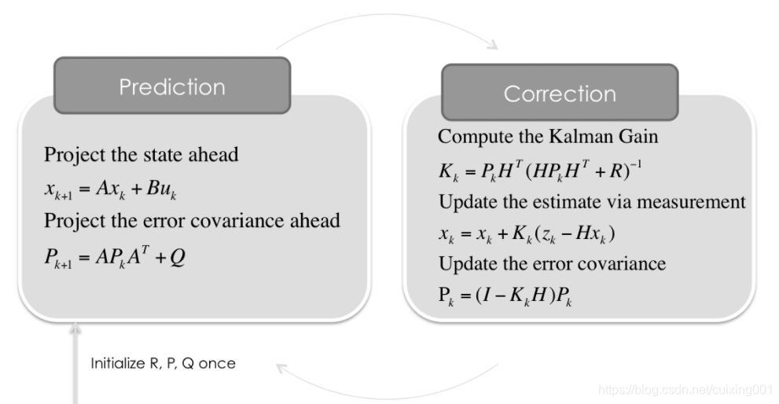

# 卡尔曼滤波

## 2022-11-12

### （一）目的

对一个线性高斯模型，将观测值进行平滑（即噪声过滤）处理，得出想要的（抖动小，误差小）状态量。

【线性】：状态量是线性的；【处理噪声，测量噪声】：符合正态分布。

### （二）基本处理循环

1. 【t-1时刻对t时刻的预测状态误差估计协方差矩阵P】 得到 【t时刻增卡尔曼益系数K】

2. 【t时刻增卡尔曼益系数K】 & 【t-1时刻对t时刻的预测值】 & 【t时刻观测值】得到 【t时刻的最优状态量x】 & 【t时刻的协方差矩阵P】
    > x即为每时刻的输出（滤波后的值）

3. 【t时刻的最优状态量x】 & 【t时刻的协方差矩阵P】 得到 【t时刻对t+1时刻的预测值】 & 【t时刻对t+1时刻的协方差矩阵P】

### （三）调节超参数Q、R

- Q：处理噪声矩阵，它描述预测模型带来的不确定情况，值越大越表明预测越不可靠，算法最后结果更靠近测量值。

- R：测量噪声矩阵，它描述测量/检测过程中带来的不确定情况，值越大越表明测量越不可靠，算法最后结果更靠近预测值。
