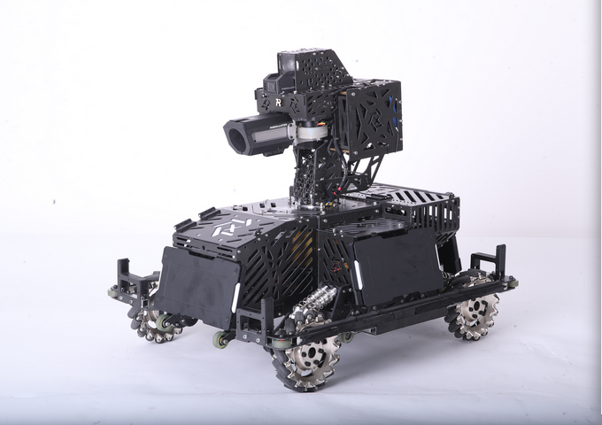

# 相机

## 相机位姿

### 概念理解

相机位姿是相机在世界坐标系下的位置&姿态。世界坐标系由我们决定，由相机相对于世界坐标系原点的旋转矩阵**R**和平移向量t描述。由此我们得到相机在世界坐标系下的空间位置&姿态。

由于`相机坐标系`原点定义在相机光心，所以相机位姿其实就是`相机坐标系`在`世界坐标系`中的空间位置&姿态。`世界坐标系`下的点向`相机坐标系`下的点的转换便可由旋转矩阵**R**和平移向量t计算。旋转矩阵**R**和平移向量t即相机外参。

## 内参&外参

- **[一文带你搞懂相机内参外参(Intrinsics & Extrinsics) - 知乎](https://zhuanlan.zhihu.com/p/389653208)**

## 摄像头数据输出格式

### RAW

> 这是图像传感器捕获的原始数据，没有经过任何处理或压缩，通常以二进制形式存储。这种格式的数据包含了最大范围的信息，但其文件会很大。

### YUV

> 这种格式将图像的亮度信息（**Y**）和颜色信息（**U** 和 **V**）分离开，这样可以根据需要对这两种信息进行不同程度的压缩。常见的有YUV420、YUV422和YUV444等。

### RGB

> 这种格式将图像分为红色、绿色和蓝色三个通道，每个像素由红、绿、蓝三个分量表示，通常使用24位或32位的数据表示。颜色的变化和复杂性可以得到很好的保留，但文件大小相比YUV会大一些。

### JPEG

> 这种格式使用了一种名为离散余弦变换的技术对图像进行压缩，以减少文件的大小。然而，这种压缩是有损的，意味着一些图像信息将会丢失。

### MJPEG

> 使用JPEG压缩算法对每帧图像进行压缩，输出为一系列JPEG图像。这种格式是对一系列JPEG图像的简单封装，用于视频流。

### H.264/AVC、H.265/HEVC等

> 视频压缩标准（视频编码标准），可以有效地压缩视频数据，使其在保持高画质的同时，占用较小的存储空间和带宽。输出为压缩后的视频流。

### 深度数据

> 通常深度数据使用整形数进行表示，范围在0-65535之间，类型为UINT16，即unsigned short，无符号2字节。单位为毫米mm。

## 相机基础知识&robomaster视觉任务梳理

> 与李轩学长的交流总结

### 基础知识

1. `我们得到的相机图像是有畸变的，在自动识别，神经网络处理时均不修正！` *（理想的小孔成像模型，物和像满足相似三角形的关系。实际上由于相机光学系统制造工艺的误差，实际成像与理想成像存在几何失真，称为畸变。畸变主要分为径向畸变和切向畸变）*

2. 相机坐标系：以`光心`（凸透镜中心、小孔成像的孔）为坐标原点。一般沿主光轴向外为Z轴；水平向右为X轴；竖直向下为Y轴。

3. 归一化平面：原像素（成像）平面（小孔成像中倒着的蜡烛）（ ， ，-f）关于`光心`，对称翻转后的像素的平面（x，y，f）再归一化，使坐标为（x/f，y/f，1）。【`相机坐标系下的坐标`】

4. 一般想要得到`目标物体`相对于自己（相机）的位置，所以世界坐标系一般建在`目标物体`上。

### 步兵视觉任务梳理



目标：得到敌方机器人装甲板相对于自己的位置。

相机坐标系：以摄像头`光心`为坐标原点。沿枪管射出方向为Z轴；水平向右为X轴；竖直向上为Y轴。

世界坐标系：以`敌方`装甲板中心为坐标原点。装甲板法线方向向外为Z轴；水平向右为X轴；竖直向上为Y轴。

（坐标系XYZ轴方向学长们定的）

#### **任务流程：**

1. 获取`我方`相机图像。（有畸变，未修正）
2. 神经网络处理得到装甲板`像素坐标`。
3. 相机畸变修正，（仅对`像素坐标`那几个点），得到`正确的，修正后的，像素坐标`。
4. 再得到`相机坐标系下的坐标`。
5. 由于装甲板尺寸已知，所以装甲板四端点`世界坐标`已知。通过装甲板四端点`相机坐标系下的坐标`与`世界坐标`对应关系得`世界坐标系`对`相机坐标系`的`旋转矩阵`and`平移向量`。
6. `平移向量`即得到了`敌方机器人装甲板相对于自己的位置`。

### 双相机


- C1、C2：两相机的`光心`。

- O1、O2：关于`光心`翻转后的像素（成像）平面中心。


## 结构光3D相机 奥比中光（ORBBEC）Astra+


### > 参数


### > SDK使用总结

*针对OrbbecSDK_Python_v1.2.7_202309141846_aaf4046_release.zip*

- [3D视觉开发者社区|3D视觉开发者社区SDK功能说明以及使用步骤(New)
](https://developer.orbbec.com.cn/v/forum_detail/14557)
- [3D视觉AI开放平台|开发者资源中心](https://vcp.developer.orbbec.com.cn/resourceCenter?defaultSelectedKeys=55)

#### SDK编译&安装

##### 官方文档（Orbbec SDK Python Wrapper文档）:

**系统要求**

- 操作系統
  - Windows：Windows 10 (x64)
  - Linux: 18.04/20.04/22.04 (x64)
  - Arm32: 18.04/20.04/22.04
  - Arm64: Ubuntu18.04/20.04/22.04
- 编译平台要求
  - Windows：Visual Studio 2017 及以上
  - Linux: gcc 5.4.0 及以上
  - cmake: 3.15.0 及以上
  - pybind11 2.10.3 及以上
- Python 版本
  - Python 3.6.9 及以上

**Linux python SDK 编译**

下载 python sdk 源码

```Bash
git clone https://github.com/OrbbecDeveloper/pyorbbecsdk.git
```

安装依赖

```Bash
sudo apt-get install python3-dev python3-venv python3-pip python3-opencv
```

Python SDK 编译

```Bash
cd pyorbbecsdk
# Strongly recommended create virtual environment.
python3 -m venv  ./venv
source venv/bin/activate # activate virtual environment
pip3 install -r requirements.txt
mkdir build
cd build
cmake -Dpybind11_DIR=`pybind11-config --cmakedir` ..
make -j4
make install
```

测试 Sample

```Bash
cd pyorbbecsdk
# set PYTHONPATH environment variable to include the lib directory in the install directory
export PYTHONPATH=$PYTHONPATH:$(pwd)/install/lib/
# install udev rules
sudo bash ./scripts/install_udev_rules.sh
sudo udevadm control --reload-rules && sudo udevadm trigger
# run examples
python3 examples/depth_viewer.py
```

##### 说明

1. `pip3 install -r requirements.txt`这一行安装了`pybind11[global]`

2. 下面代码安装了相机的 udev 规则（Linux），用于让SDK找到并有权限调用相机。

    ```Bash
    # install udev rules
    sudo bash ./scripts/install_udev_rules.sh
    sudo udevadm control --reload-rules && sudo udevadm trigger
    ```

3. SDK编译`make -j4`&安装`make install`完后，会在`WorkSpace/install/lib/`下生成4个文件：`libOrbbecSDK.so`、`libOrbbecSDK.so.1.7`、`libOrbbecSDK.so.1.7.4`、`pyorbbecsdk.cpython-39-x86_64-linux-gnu.so`。其中`libOrbbecSDK.so`是指向`libOrbbecSDK.so.1.7`的软链接；`libOrbbecSDK.so.1.7`是指向`libOrbbecSDK.so.1.7.4`的软链接。

4. 生成的`pyorbbecsdk.cpython-39-x86_64-linux-gnu.so`文件是一个可被Python解释器直接导入的动态链接库。将它放到`PYTHONPATH`中的路径下，即可使用`import pyorbbecsdk`导入调用。**注意：**`pyorbbecsdk.cpython-39-x86_64-linux-gnu.so`在被编译生成时，就已经指定了其许多依赖，在第一次被Python解释器导入时，会自动加载和链接。由ldd命令行工具，查看它的依赖关系如下：

    ```Bash
    zxq@FX63VD:~/WorkSpace/ORBBEC$ ldd pyorbbecsdk.cpython-39-x86_64-linux-gnu.so
        linux-vdso.so.1 (0x00007ffe277fb000)
        libOrbbecSDK.so.1.7 => /home/zxq/WorkSpace/pyorbbecsdkV127/install/lib/libOrbbecSDK.so.1.7 (0x00007fca83ee8000)
        libpython3.9.so.1.0 => /home/zxq/anaconda3/envs/pyORBBECSDK/lib/libpython3.9.so.1.0 (0x00007fca83b59000)
        libstdc++.so.6 => /home/zxq/anaconda3/envs/pyORBBECSDK/lib/libstdc++.so.6 (0x00007fca83945000)
        libgcc_s.so.1 => /home/zxq/anaconda3/envs/pyORBBECSDK/lib/libgcc_s.so.1 (0x00007fca8392b000)
        libc.so.6 => /lib/x86_64-linux-gnu/libc.so.6 (0x00007fca83722000)
        libpthread.so.0 => /lib/x86_64-linux-gnu/libpthread.so.0 (0x00007fca836fd000)
        librt.so.1 => /lib/x86_64-linux-gnu/librt.so.1 (0x00007fca836f3000)
        libudev.so.1 => /lib/x86_64-linux-gnu/libudev.so.1 (0x00007fca836c6000)
        libm.so.6 => /lib/x86_64-linux-gnu/libm.so.6 (0x00007fca83577000)
        /lib64/ld-linux-x86-64.so.2 (0x00007fca85a88000)
        libdl.so.2 => /lib/x86_64-linux-gnu/libdl.so.2 (0x00007fca83571000)
        libutil.so.1 => /lib/x86_64-linux-gnu/libutil.so.1 (0x00007fca8356c000)
    ```

#### SDK使用

**`pyorbbecsdk`中，定义的类、属性、方法等全部内容，使用`dir(object)`或`help(object)`查看。**

##### 数据类型

- **`frames`**：`frames: orbbec.FrameSet = pipeline.wait_for_frames(100)`：以阻塞的方式等待一帧数据，该帧是一个复合帧，里面包含配置里启用的所有流的帧数据，并设置帧的等待超时时间为100ms。

- 由下面代码分别拿到各自sensor的一帧后，还需调用各自`frame`的`.get_data()`转换成`numpy`的数组。转换后得到的是`numpy`类型的**一维数组**

    ```Python
    color_frame = frames.get_color_frame()
    depth_frame = frames.get_depth_frame()
    ```

- 彩色相机数据格式`OBFormat.RGB`：返回数组每个值（像素）为 (R,G,B)
- 深度相机数据格式`OBFormat.Y16`：返回数组每个值为一16位无符号整数`uint16`，单位为mm，不在工作范围内为0。例如：2600，即该像素点对应的物理空间中该点距相机光心2.6m

##### D2C（深度图对齐彩色图）

- **对齐**：由于3D相机多个摄像头间有距离，所以拍摄得到的画面是在不同相机位姿下的，需要统一。D2C即将深度图对齐彩色图，使相同像素坐标的像素对应的是物理空间中同一点。注意：D2C后，深度图四周会有一圈较宽的无效区域，其值为0
- **设置**

    ```Python
    self.device.set_bool_property(OBPropertyID.OB_PROP_DEPTH_ALIGN_HARDWARE_BOOL, True)     # 硬件d2c 开
    self.config.set_align_mode(OBAlignMode.HW_MODE)                                         # 使用硬件对齐
    ```

- 该相机D2C只能在640*480分辨率下对齐。

##### 相机拍摄参数

- 对`pyorbbecsdk.Device`这个类的对象进行设置。
- 通过传入`OBPropertyID`中对应属性的枚举成员，设置对应的属性参数。
- 获取相机启动后默认的值：
  - int型：`device.get_int_property(OBPropertyID.XXX)`
  - bool型：`device.get_bool_property(OBPropertyID.XXX)`
- 设置属性参数的值：
  - int型： `device.set_int_property(OBPropertyID.XXX, 值)`
  - bool型：`device.set_bool_property(OBPropertyID.XXX, True or False)`
- 获取相机支持的`property`：`device.get_supported_property()`
- 相机断电重启后其拍摄参数会恢复默认值。

##### 编写的相机模块`Astra+.py`

```Python
import numpy as np
import cv2
import pyorbbecsdk as orbbec
from pyorbbecsdk import StreamProfileList , OBFormat , OBSensorType , OBPropertyID ,OBAlignMode ,OBCameraParam

class Astra():
    def __init__(self, model=0) -> bool:

        # -----------------------------------------------------------------------------------
        # model = 0 只开启彩色相机
        # model = 1 开启彩色相机和深度相机
        # 大小均为640*480
        # -----------------------------------------------------------------------------------
        self.model = model


        # 获取设备
        self.context = orbbec.Context()
        self.device_list = self.context.query_devices()
        if self.device_list.get_count() == 0:
            print("Device not found!")
            return False
        self.device = self.device_list.get_device_by_index(0)
        # 创建流对象
        self.pipeline = orbbec.Pipeline(self.device)    # 定义流程pipeline
        self.config = orbbec.Config()                   # 定义配置config


        # 设置流配置
        if self.model == 0:     # 只开启彩色相机
            self.profile_list = self.pipeline.get_stream_profile_list(OBSensorType.COLOR_SENSOR)
            self.color_profile: VideoStreamProfile = self.profile_list.get_video_stream_profile(640, 480, OBFormat.RGB, 30)

            self.config.enable_stream(self.color_profile)
        elif self.model == 1:   # 开启彩色相机和深度相机
            self.profile_list = self.pipeline.get_stream_profile_list(OBSensorType.COLOR_SENSOR)
            self.color_profile: VideoStreamProfile = self.profile_list.get_video_stream_profile(640, 480, OBFormat.RGB, 30)

            self.profile_list2 = self.pipeline.get_stream_profile_list(OBSensorType.DEPTH_SENSOR)
            self.depth_profile: VideoStreamProfile = self.profile_list2.get_video_stream_profile(640, 480, OBFormat.Y16, 30)

            self.config.enable_stream(self.color_profile)
            self.config.enable_stream(self.depth_profile)
        else:
            print("model is not 0 or 1")
            return False


        # 相机参数设置

        # 彩色相机
        # 彩色相机曝光调节
        self.device.set_bool_property(OBPropertyID.OB_PROP_COLOR_AUTO_EXPOSURE_BOOL, True) # 彩色相机自动曝光 开

        # 手动设置曝光：1.将自动曝光关 2.设置曝光值
        # AUTO_EXPOSURE = self.device.get_int_property(OBPropertyID.OB_PROP_COLOR_EXPOSURE_INT)
        # EXPOSURE = AUTO_EXPOSURE - 50
        # self.device.set_int_property(OBPropertyID.OB_PROP_COLOR_EXPOSURE_INT, EXPOSURE)# 彩色相机曝光 值

        # 彩色相机增益调节
        # self.device.set_int_property(OBPropertyID.OB_PROP_COLOR_GAIN_INT, 10000)
    
        # 彩色相机白平衡
        self.device.set_bool_property(OBPropertyID.OB_PROP_COLOR_AUTO_WHITE_BALANCE_BOOL, True)     # 彩色相机自动白平衡
        # self.device.set_int_property(OBPropertyID.OB_PROP_COLOR_WHITE_BALANCE_INT, 10)              # 彩色相机白平衡调节

        # 彩色相机对比度调节
        # self.device.set_int_property(OBPropertyID.OB_PROP_COLOR_CONTRAST_INT, 1)

        # 彩色相机饱和度调节
        # self.device.set_int_property(OBPropertyID.OB_PROP_COLOR_SATURATION_INT, 100)

        # 彩色相机亮度调节
        # self.device.set_int_property(OBPropertyID.OB_PROP_COLOR_BRIGHTNESS_INT, 1)

        # 彩色相机锐度调节
        # self.device.set_int_property(OBPropertyID.OB_PROP_COLOR_SHARPNESS_INT,10)

        # 彩色相机彩色色调
        # self.device.set_int_property(OBPropertyID.OB_PROP_COLOR_HUE_INT,50)

        # 深度相机
        if model == 1:
            # 对齐
            self.device.set_bool_property(OBPropertyID.OB_PROP_DEPTH_ALIGN_HARDWARE_BOOL, True) # 硬件d2c 开
            self.config.set_align_mode(OBAlignMode.HW_MODE)                                     # 使用硬件对齐
            
            # 最小深度阈值
            # self.device.set_int_property(OBPropertyID.OB_PROP_MIN_DEPTH_INT, 180)
            # 最大深度阈值
            # self.device.set_int_property(OBPropertyID.OB_PROP_MIN_DEPTH_INT, 18000)


        # 数据流开启
        self.pipeline.start(self.config)

        return True

    # 取一帧RGB图像
    def get_RGB_image(self):
        while True:
            frames: orbbec.FrameSet = self.pipeline.wait_for_frames(100)
            if frames is None:
                continue
            color_frame = frames.get_color_frame()  # OBFormat.RGB
            # 彩色图
            if color_frame is None:
                continue

            break

        # 处理：直接得到的是一维数据
        color_data = np.asanyarray(color_frame.get_data())
        color_image = np.resize(color_data, (480, 640, 3))

        # 返回三维rgb图像
        return color_image
    
    # 取一帧BGR图像
    def get_BGR_image(self):
        while True:
            frames: orbbec.FrameSet = self.pipeline.wait_for_frames(100)
            if frames is None:
                continue
            color_frame = frames.get_color_frame()  # OBFormat.RGB
            # 彩色图
            if color_frame is None:
                continue

            break

        # 处理：直接得到的是一维数据
        color_data = np.asanyarray(color_frame.get_data())
        color_image = np.resize(color_data, (480, 640, 3))

        # cv2.RGB -> cv2.BGR
        color_image = cv2.cvtColor(color_image, cv2.COLOR_RGB2BGR)

        # 返回三维bgr图像
        return color_image
    
    # 获取相机参数
    def get_CameraParam(self) -> OBCameraIntrinsic:
        self.param = self.pipeline.get_camera_param()
        intr = self.param.rgb_intrinsic
        depth_intrin = self.param.depth_intrinsic
        # < OBCameraIntrinsic fx = 475.757019 fy = 475.757019 cx = 330.705933 cy = 239.390900 width = 640 height = 480 >
        # <class 'pyorbbecsdk.OBCameraIntrinsic'>

        return intr, depth_intrin
    
    # 获取设备信息
    def get_DeviceInfo(self):
        device_info = self.device.get_device_info()
        device_name = device_info.get_name()
        device_pid = device_info.get_pid()
        serial_number = device_info.get_serial_number()
        return device_name, device_pid, serial_number
    

    # 获取对齐的深度图与彩色图
    def get_color_depth_images(self):
        while True:
            frames: orbbec.FrameSet = self.pipeline.wait_for_frames(200)
            if frames is None:
                continue

            color_frame = frames.get_color_frame() # OBFormat.RGB
            depth_frame = frames.get_depth_frame()
            # 彩色图
            if color_frame is None:
                continue
            # 深度图
            if depth_frame is None:
                continue

            break

        # 彩色
        color_data = np.asanyarray(color_frame.get_data())
        color_image = np.resize(color_data, (480, 640, 3)) # RGB
        color_image = cv2.cvtColor(color_image, cv2.COLOR_RGB2BGR) # RGB -> BGR

        # 深度
        depth_data = np.frombuffer(depth_frame.get_data(), dtype=np.uint16) # 一维，每个值为一16位整数，单位mm的深度数值
        depth_image = depth_data.reshape((480, 640))

        # 转换为8位深度图
        depth_image_8bit = cv2.convertScaleAbs(depth_image, alpha=0.1)  # 数值缩小10倍，现单位cm，丢掉一位精度，超过255（即2.55m）置255

        # 返回彩色图BGR、深度图、8位深度图
        return color_image, depth_image, depth_image_8bit

# test
if __name__=="__main__":
    astra = Astra(1)

    info = astra.get_DeviceInfo()
    print(info)
```
