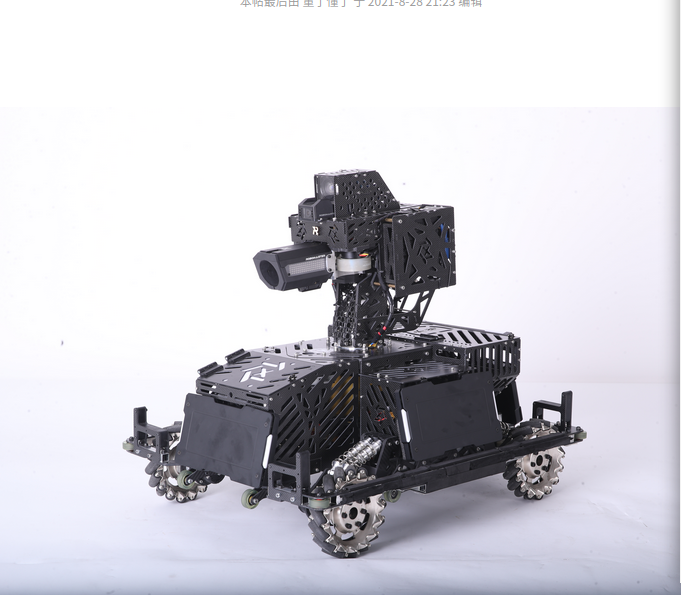
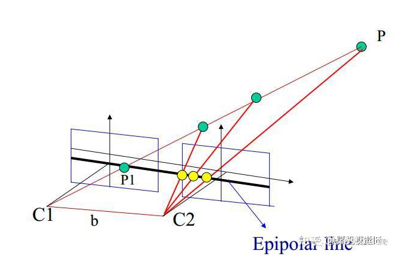
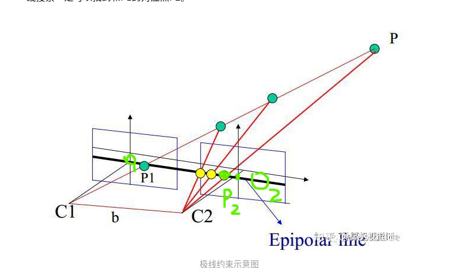

# 相机标定原理&robomaster视觉任务梳理

## 常识

1. `我们得到的相机图像是有畸变的，在自动识别，神经网络处理时均不修正！` *（理想的小孔成像模型，物和像满足相似三角形的关系。实际上由于相机光学系统制造工艺的误差，实际成像与理想成像存在几何失真，称为畸变。畸变主要分为径向畸变和切向畸变）*

2. 相机坐标系：以`光心`（凸透镜中心、小孔成像的孔）为坐标原点。一般沿主光轴向外为Z轴；水平向右为X轴；竖直向下为Y轴。

3. 归一化平面：原像素（成像）平面（小孔成像中倒着的蜡烛）（ ， ，-f）关于`光心`，对称翻转后的像素的平面（x，y，f）再归一化，使坐标为（x/f，y/f，1）。【`相机坐标系下的坐标`】

4. 一般想要得到`目标物体`相对于自己（相机）的位置，所以世界坐标系一般建在`目标物体`上。

## 步兵视觉任务梳理

目标：得到敌方机器人装甲板相对于自己的位置。

相机坐标系：以摄像头`光心`为坐标原点。沿枪管射出方向为Z轴；水平向右为X轴；竖直向上为Y轴。

世界坐标系：以`敌方`装甲板中心为坐标原点。装甲板法线方向向外为Z轴；水平向右为X轴；竖直向上为Y轴。

（坐标系XYZ轴方向学长们定的）

### **任务流程：**

1. 获取`我方`相机图像。（有畸变，未修正）
2. 神经网络处理得到装甲板`像素坐标`。
3. 相机畸变修正，（仅对`像素坐标`那几个点），得到`正确的，修正后的，像素坐标`。
4. 再得到`相机坐标系下的坐标`。
5. 由于装甲板尺寸已知，所以装甲板四端点`世界坐标`已知。通过装甲板四端点`相机坐标系下的坐标`与`世界坐标`对应关系得`世界坐标系`对`相机坐标系`的`旋转矩阵`and`平移向量`。
6. `平移向量`即得到了`敌方机器人装甲板相对于自己的位置`。

## 双相机

- C1、C2：两相机的`光心`。

- O1、O2：关于`光心`翻转后的像素（成像）平面中心。

