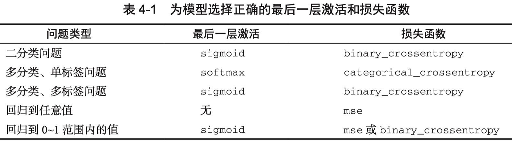

# 神经网络基础学习总结

## 一、基本认识

- 神经网络（nn），有建立在它之上的许多类型。卷积神经网络，循环神经网络等等，常用于视觉图像处理领域的是卷积神域网络（cnn）。
- LeNet：是一种的用于处理手写数字识别的经典卷积神经网络，他的问世，写数字识别准确率得到大大的提高，取得了巨大的成功。
- 神经网络的本质是对回归任务做回归。

## 二、卷积神经网络基本组成

### 感知机

由一堆线性参数w和偏置参数b，将输入它的所有参数与w相乘再加上参数b，再由激活函数激活输出。

### 卷积层

用多层卷积核对图像进行卷积运算。提取图像特征。

### 池化层

分为均值池化和最大池化。在保留图像特征的同时，极大的减少了计算量and防止过拟合现象。

### 全连接层

1. 传统的神经网络架构。它的每一层中的每一个感知机都与前一层每一个感知机相连。由于他这样的特性会使得他的输出会与所有的数据相关，卷积池化解决了这样的问题。

2. 现一般用于网络最后几层。

### 激活函数

1. Sigmoid：容易梯度过小，不利于反向传播。
2. ReLU：解决了梯度过小消失的问题。函数简单，速度快。非线性不足。
3. softmax：解决了归一化问题。一般最后全连接使用。

## 三、神经网络模型训练流程

### （一）数据准备

- 数据集：神经网络训练需要大量的数据，要满足丰富（场景、明暗）、复杂（遮挡）、随机（角度）等要求。网络上由许多公共数据集。
- 数据增强：由程序随机对数据进行各种处理，可以大大增强数据量。
- 标注：数据集还需要标注，对于图像分类来说，标注就是他是哪一个分类。

### （二）模型搭建

设计针对任务的神经网络模型。有多少层，各层怎样安排等等。在计算速度和精度之间取得平衡。Python可以采用动态图的写法。选择损失函数以及后续返向传播等。设置优化器（优化算法），控制学习率，学习步长。

### （三）模型训练

大量数据进入神经网络计算输出到损失函数，损失函数与标签进行比较计算出损失，再由反向传播与梯度下降，调整神经网络各个参数，直至损失越来越小。（每次下降由步长控制。可设计计算法控制步长，防止局部最优，提高训练效率）当最后训练模型准确率达到可接受程度，训练结束。

## 四、神经网络网络设计技巧

### 卷积核

- 3-3 小卷积核多次卷积，参数量小，效果好。
- 除去第一层会采用大卷积核一般也不会超过7*7，其它层均使用3-3或者1-1卷积核。
- 巧妙的使用1-1的卷积核来进行通道降维和升维。

### 堆叠

- 神经网络层数堆叠很多时，要使用残差连接。***至少不比原来差***
- 层数深 感受野大；层数浅 感受野小。
- 网络通常为block堆叠，每一个block都是一个最小重复单元（由多个卷积组成）。

### 其他

- 通常在进行下采样的时候会进行channel数量的翻倍。
- 在网络的特征提取部分，使用最大池化。在分类部分，使用平均池化。

## 五、算法选择

### （一）损失函数

>损失函数（loss function）就是用来度量模型的预测值f(x)与真实值Y的差异程度的运算函数。

1. 最小二乘法&均方误差（mean-squared error)
2. 极大似然估计法&交叉熵法（计算上相同，前者由概率论导出；后者由信息论导出）



### （二）优化算法

- BGD、SGD、MBGD分别为批量梯度下降算法、随机梯度下降算法、小批量梯度下降算法。这三个优化算法在训练的时候采用的数据量不同，但是他们在进行参数优化的时候是相同的。基本思想是：先设定一个学习率，参数沿梯度的反方向移动。
  1. 对超参数学习率比较敏感（过小导致收敛速度过慢，过大又越过极值点）。
  2. 学习率除了敏感，有时还会因其在迭代过程中保持不变，很容易造成算法被卡在鞍点的位置。
  3. 在较平坦的区域，由于梯度接近于0，优化算法会因误判，在还未到达极值点时，就提前结束迭代，陷入局部极小值。

- Momentum（动量算法）：从梯度方向优化的算法。每下降一步都是由前面下降方向的一个累积和当前点梯度方向组合而成。

- NAG算法，它是动量算法的一种优化。

- AdaGrad算法是通过参数来调整合适的学习率，是能独立自动调整模型参数的学习率，对稀疏参数进行大幅更新和对频繁参数进行小幅更新。

- RMSProp算法通过修改AdaGrad得来，其目的是在非凸背景下效果更好。

- SGD，NAG以及Momentum对于模型中的不同参数，他们均使用相同的学习率，这会导致那些应该更新快的参数更新的慢，而应该更新慢的有时候又会因为数据的原因的变得快。不适合稀疏的数据。

- 稀疏的数据应该使用Adaptive方法（Adagrad、AdaDelta、Adam）。同样，对于一些深度神经网咯或者非常复杂的神经网络，使用Adam或者其他的自适应（Adaptive）的方法能够更快的收敛。

参考：[优化器(Optimizer)（SGD、Momentum、AdaGrad、RMSProp、Adam）](https://blog.csdn.net/tcn760/article/details/123965374/)

## 六、调参

1. 使用公开的模型预参数进行训练，加快收敛。
2. 数据集，全、复杂、样本量大，使用数据增强。
3. 设定恰当的lr（学习率）：过小导致收敛速度过慢，过大又越过极值点，或使用lr自适应的优化算法。
4. batchsize（样本批次容量）：不能太大也不能太，一般几十到几百。
5. epoch-number（训练次数）：观察accuracy/loss，前面快，后面很慢，十几轮一直上下浮动基本到极限了。
6. 使用可视化工具观察。

## 七、LeNet

```Python
def forward(self, x):                       #[ N ,1,28,28]
        x = self.conv1(x)                   #[ N ,6,24,24]
        x = F.sigmoid(x)                    #[ N ,6,24,24]
        x = self.max_pool1(x)               #[ N ,6,12,12]
        x = F.sigmoid(x)                    #[ N ,6,12,12]
        x = self.conv2(x)                   #[ N ,16,8,8]
        x = self.max_pool2(x)               #[ N ,16,4,4]
        x = self.conv3(x)                   #[ N ,120,1,1]
        x = paddle.reshape(x, [x.shape[0], -1])   #[ N ,120]
        x = self.fc1(x)                     #[ N ,64]
        x = F.sigmoid(x)                    #[ N ,64]
        x = self.fc2(x)                     #[ N ,10]
        return x
```

### **结构**

- 输入
  - （1,28,28）一张图片，大小28*28
- 卷积层
  - （6,24,24）用6个5-5的卷积核卷积一次
  - （6,24,24）激活
  - （6,12,12）最大池化，kernel_size=2, stride=2
  - （6,12,12）激活
  - （16,8,8）用16个5-5的卷积核卷积一次
  - （16,4,4）最大池化，kernel_size=2, stride=2
  - （120,1,1）用120个4-4的卷积核卷积一次
- 全连接层
  - 64感知机，全连接
  - 64 激活感知机输出
  - 10感知机，全连接
